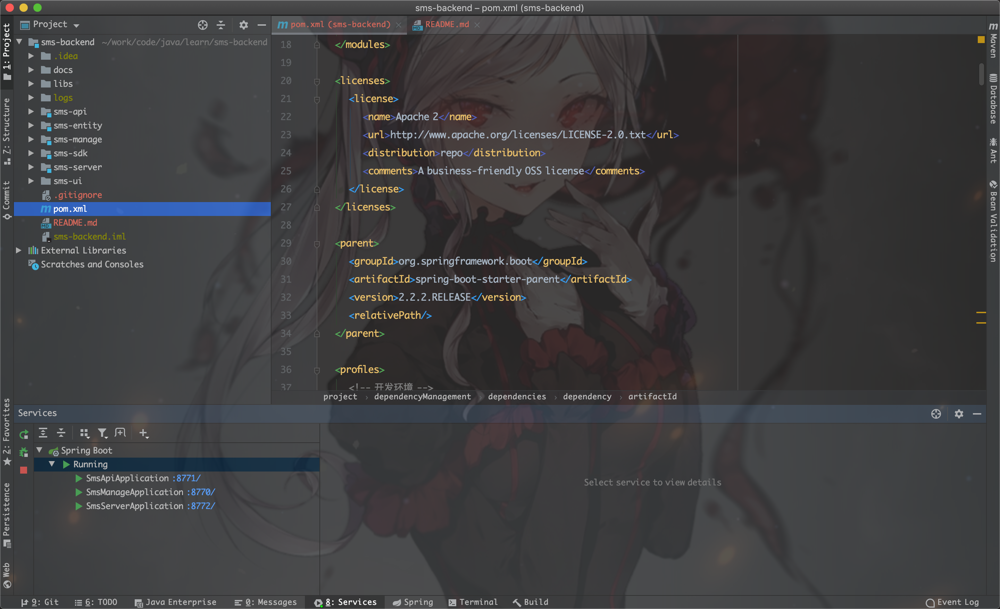
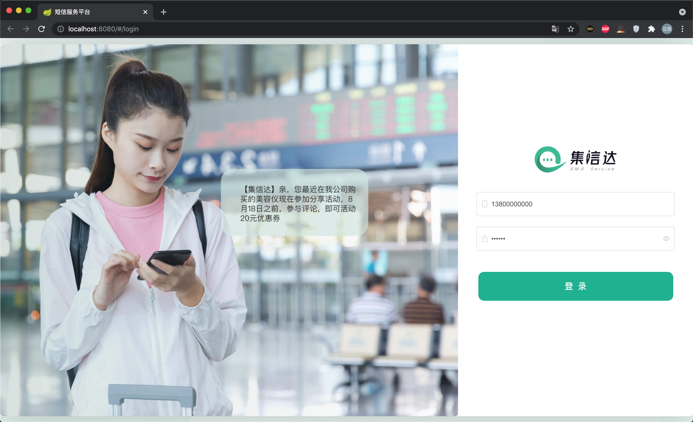
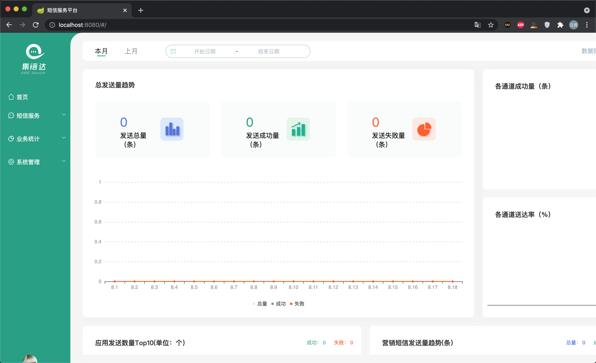
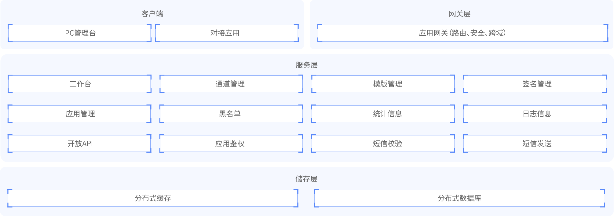
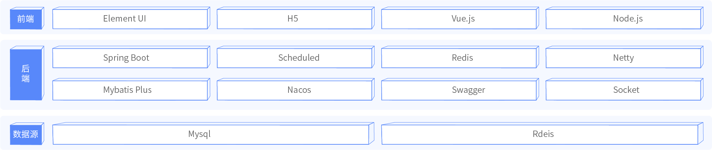

# 集信达-短信平台

## 01.基本介绍

### 01-01.背景

随着企业业务扩张, 应用成倍的增加, 短信规模化使用, 传统短信平台的接入方式和单一的信息发送功能, 已经不能完全满足现代企业管理的需求, 所以统一入口, 减少对接成本, 同时兼顾多种短信业务, 简单易行的操作与维护, 高稳定, 高可靠的移动信息化应用成为短信平台发展趋势.

项目核心在于保证短信高效, 准确的送达, 简单易操作的对接方式. 通过对服务的解耦, 通讯方式的升级来提升系统的吞吐量. 同时在多通道的加持下, 通过智能动态的通道评级, 选举, 降级, 热插拔, 增强了系统的健壮性, 摆脱对单一通道的依赖. 并且提供多种对接方式, 满足企业内部的各种需求.

### 01-02.问题

- 服务越来越多, 每个服务都有可能发送短信, 是否每个服务都需要对接一遍?
- 多应用对接短信, 如何做到短信发送服务高效, 稳定?
- 短信通道出现异常时, 如何快速切换通道?
- 切换通道时, 如何做到应用服务无感知?
- 如何统计各服务短信发送情况, 以便进行后续营销分析?

### 01-03.功能预览







## 02.项目架构

### 02-01.功能架构



### 02-02.系统架构



## 03.模块介绍与环境搭建

### 03-01.项目模块介绍

整体模块说明:

```shell
sms-backend			     # 短信平台父工程
	├── sms-entity		 # 短信平台实体
	├── sms-manage		 # 系统管理服务
	├── sms-api			   # 短信接收服务, 应用系统调用接口, 发送短信
	├── sms-server		 # 短信发送服务, 调用短信通道, 发送短信
	└── sms-sdk			   # 短信SDK, 应用系统引入, 发送短信
```

短信服务有三个: 后台管理服务, 短信接收服务, 短信发送服务.

| 应用       | 端口 | 说明         | 启动命令                      |
| ---------- | ---- | ------------ | ----------------------------- |
| sms-manage | 8770 | 后台管理服务 | java -jar pd-sms-manage.jar & |
| sms-api    | 8771 | 短信接收服务 | java -jar pd-sms-api.jar &    |
| sms-server | 8772 | 短信发送服务 | java -jar pd-sms-server.jar & |

### 03-02.环境需求

- JDK  1.8 +
- Maven 3.3 +
  - http://maven.apache.org/download.cgi
- Docker 18 +
- docker-compose 1.23  +
- Mysql 5.7.0 +
  - https://downloads.mysql.com/archives/community
- Redis 4.0 +
  - https://redis.io/download
- Nacos 1.1.4
  - https://github.com/alibaba/nacos/releases
- Node  11.3+
  - https://nodejs.org/en/download

### 03-03.Nacos搭建

```shell
# 拉取镜像
docker pull nacos/nacos-server:1.3.1

# 创建容器
docker run --name nacos -d \
-p 8848:8848 \
--env MODE=standalone \
docker.io/nacos/nacos-server:1.3.1
```

### 03-04.MySQL搭建

```shell
# 拉取镜像
docker pull mysql:5.7

# 创建容器
docker run --name mysql \
--privileged=true \
-p 3306:3306 \
-e MYSQL_ROOT_PASSWORD=yueliminvc@outlook.com \
-d mysql:5.7
```

## 04.Redis集群搭建

### 04-01.配置文件

在配置从库的时候需要获取主库容器的IP地址.

```properties
# 查询master与slave的容器ip地址
docker inspect redis-master | grep IPAd
docker inspect redis-slave-1 | grep IPAd
docker inspect redis-slave-2 | grep IPAd

# master
"IPAddress": "172.17.0.2"
```

---

```properties
port 6379
protected-mode no

save 900 1
save 300 10
save 60 10000

rdbcompression yes
stop-writes-on-bgsave-error no
appendonly yes
requirepass "yueliminvc@outlook.com"
masterauth "yueliminvc@outlook.com"
bind 0.0.0.0
# logfile "/redis/logs/redis.log"
```

---

```properties
port 6380
protected-mode no

save 900 1
save 300 10
save 60 10000

rdbcompression yes
stop-writes-on-bgsave-error no
appendonly yes
requirepass "yueliminvc@outlook.com"
masterauth "yueliminvc@outlook.com"
slave-read-only yes

bind 0.0.0.0
slaveof 172.17.0.2 6379
# logfile "/redis/logs/redis.log"
```

---

```properties
port 6381
protected-mode no

save 900 1
save 300 10
save 60 10000

rdbcompression yes
stop-writes-on-bgsave-error no
appendonly yes
requirepass "yueliminvc@outlook.com"
masterauth "yueliminvc@outlook.com"
slave-read-only yes

bind 0.0.0.0
slaveof 172.17.0.2 6379
# logfile "/redis/logs/redis.log"
```

### 04-02.创建容器

```shell
# 拉取镜像
docker pull redis:4

# 创建redis master
docker run -id --name redis-master \
--privileged=true \
-v /root/docker/redis:/conf \
-p 6379:6379 redis:4 redis-server /conf/redis-master.conf

# 创建redis slave
docker run -id --name redis-slave-1 \
--privileged=true \
-v /root/docker/redis:/conf \
-p 6380:6380 redis:4 redis-server /conf/redis-slave-1.conf

docker run -id --name redis-slave-2 \
--privileged=true \
-v /root/docker/redis:/conf \
-p 6381:6381 redis:4 redis-server /conf/redis-slave-2.conf
```

---

```shell
# 进入master
docker exec -it redis-master /bin/bash
redis-cli
auth yueliminvc@outlook.com
info replication
```

## 05.Sentinel哨兵集群搭建

### 05-01.编辑配置文件

> sentinel.conf是启动redis-sentinel的核心配置文件, 可以从官网下载:

> wget http://download.redis.io/redis-stable/sentinel.conf

```properties
protected-mode no
bind 0.0.0.0
sentinel monitor mymaster 192.168.158.160 6379 2
sentinel auth-pass mymaster yueliminvc@outlook.com
sentinel down-after-milliseconds mymaster 5000
sentinel failover-timeout mymaster 60000
sentinel parallel-syncs mymaster 1
sentinel deny-scripts-reconfig yes
# logfile "/redis/logs/sentinel.log"
```

将上面的`sentinel.conf`复制三份, 分别为`sentinel1.conf`,`sentinel2.conf`和`sentinel3.conf`.

### 05-02.搭建实例

```shell
# redis-sentinel实例1
docker run -id --name redis-sentinel-1 -p 26379:26379 \
--privileged=true \
-v /root/docker/redis/sentinel1.conf:/usr/local/etc/redis/sentinel.conf \
redis:4 /bin/bash

# redis-sentinel实例2
docker run -id --name redis-sentinel-2 -p 26380:26379 \
--privileged=true \
-v /root/docker/redis/sentinel2.conf:/usr/local/etc/redis/sentinel.conf \
redis:4 /bin/bash

# redis-sentinel实例3
docker run -id --name redis-sentinel-3 -p 26381:26379 \
--privileged=true \
-v /root/docker/redis/sentinel3.conf:/usr/local/etc/redis/sentinel.conf \
redis:4 /bin/bash
```

```shell
docker exec -it redis-sentinel-1 /bin/bash -c 'redis-sentinel /usr/local/etc/redis/sentinel.conf'
docker exec -it redis-sentinel-2 /bin/bash -c 'redis-sentinel /usr/local/etc/redis/sentinel.conf'
docker exec -it redis-sentinel-3 /bin/bash -c 'redis-sentinel /usr/local/etc/redis/sentinel.conf'

# 注意centos7防火墙时是否关闭, 如果没有关闭防火墙, sentinel连接会出现问题.

docker exec -it redis-sentinel-1 /bin/bash -c 'redis-cli  -h 127.0.0.1 -p 26379'
sentinel master mymaster

```
